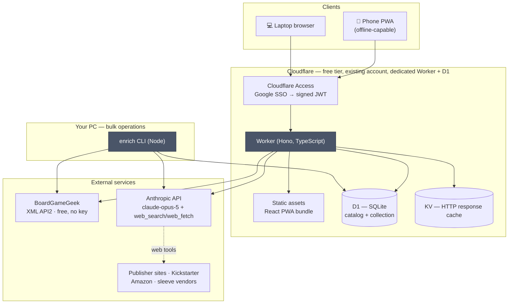
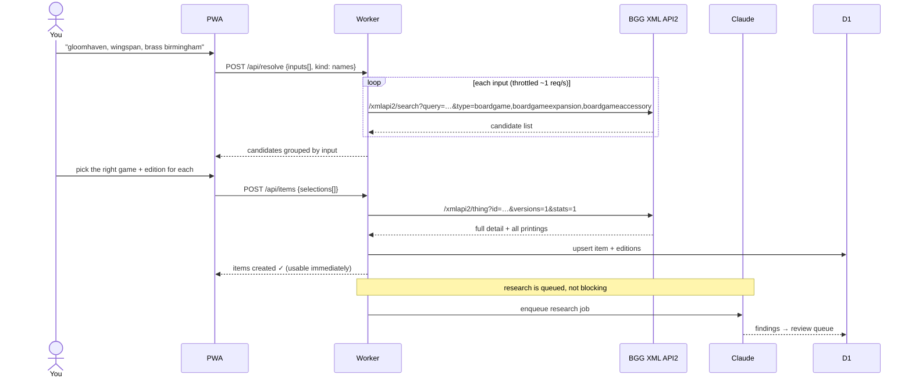
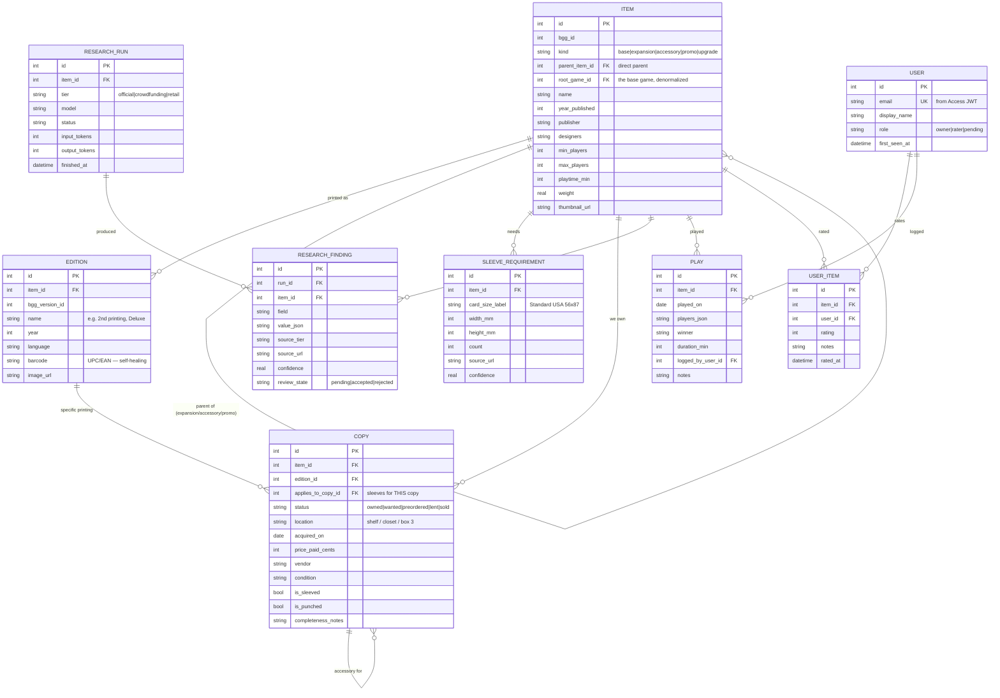

# Board Game Catalog — System Design

**Status:** design, not yet built
**Last updated:** 2026-08-04

A private, two-person catalog of a large board game collection — base games,
editions, expansions, Kickstarter exclusives, and accessories — with LLM-assisted
research to fill in the details that no single database has.

---

## 1. What this has to do

| # | Requirement | Where it's handled |
|---|---|---|
| R1 | Search a game and add it to the catalog | §4 Identity resolution |
| R2 | Track the specific **edition/printing** owned | `edition` table, BGG versions |
| R3 | Track **expansions** and **KS/exclusive content**, each attributed to its base game | `item.kind`, `parent_item_id`, `root_game_id` |
| R4 | Track **accessories** — sleeves, inserts, playmats — also under the base game | `item.kind='accessory'`, `sleeve_requirement` |
| R5 | Research each item: **official site → Kickstarter → 3rd party**, in that order | §5 Research pipeline (tiered) |
| R6 | Ownership + location, purchase info, play data, condition | `copy`, `play`, `user_item` |
| R7 | Add by name, name-list, barcode, or URL | §4 |
| R8 | Free hosting, usable from our phones while out | §3 Deployment |
| R9 | One joint collection; any signed-in Google user can rate | §3.1 Auth and roles |

### Decisions taken (2026-08-04)

| Question | Decision |
|---|---|
| Item scope | All four kinds — **the base game is the parent, everything else hangs off it** |
| Hosting | Cloudflare Workers + D1, existing account, dedicated Worker + DB |
| LLM runtime | Shared research module, run from both the CLI (bulk) and the Worker (on demand) |
| Research spend | **BGG-first.** Build phases 0–2 on free data; spend tokens deliberately after |
| BGG account | Exists but unmaintained → bulk-import is an optional phase-2 path, not the main road |
| Ownership | One joint collection — no per-person ownership column |
| Ratings | Per-person, keyed to Google identity; any signed-in user can rate |

---

## 2. The two ideas the whole design rests on

Everything else is plumbing. These two decisions are the ones worth arguing about
now, because they're expensive to change later.

### 2.1 Catalog and collection are separate

**`catalog`** = facts about the world. This game exists. This edition was printed
in 2019. This expansion belongs to that game. This game needs 220 standard-USA
card sleeves.

**`collection`** = facts about *us*. We own a copy. It's on the top shelf. We paid
$62 for it at Gamenerdz in March. It's sleeved. It's lent to Dave.

They're separate tables because they have different lifecycles. Catalog facts get
overwritten every time research re-runs; collection facts are yours forever and
must never be clobbered by a robot. Keeping them apart means a bad LLM run can be
thrown away without touching a single thing you typed.

### 2.2 The LLM never writes to the catalog directly

Research output lands in a **staging table** (`research_finding`) — one row per
atomic claim, each carrying its source URL, its source tier, and a confidence
score. You review findings in the UI and accept or reject them. Accepted findings
get promoted into the catalog tables.

This buys three things:

- **Hallucinations are visible, not silent.** A wrong sleeve count sits in a
  review queue with a link to where it came from, instead of quietly becoming
  "the truth" in your catalog.
- **The official → Kickstarter → retail priority has somewhere to live.** It's a
  sortable `source_tier` column, so when the publisher and Amazon disagree, the
  publisher wins by construction rather than by whichever call ran last.
- **Re-running is cheap and safe.** Re-research one tier for one game without
  disturbing the others.

---

## 3. Architecture



The two grey boxes — the Worker and the CLI — are the same research code compiled
twice. That's deliberate: `packages/research` is the one canonical implementation,
imported by both entry points. Neither entry point contains business logic; the
Worker routes HTTP and the CLI parses argv, and both delegate.

### Stack

| Layer | Choice | Why |
|---|---|---|
| Runtime | Cloudflare Workers | Free tier, no cold starts, one deploy command |
| Router | Hono | Tiny, Workers-native, good TypeScript |
| Database | Cloudflare D1 (SQLite) | Free 5 GB, SQL, `wrangler d1 migrations` built in |
| Cache | Workers KV | Cheap TTL cache for BGG + fetched pages |
| Front-end | React + Vite (or Preact) | SPA needed for offline + camera access |
| Data fetching | TanStack Query | Cache/invalidation without hand-rolling it |
| Validation | Zod | One schema shared by Worker, CLI, and UI |
| Auth | Cloudflare Access, Google IdP | Google SSO with zero auth code; free to 50 seats |
| LLM | Anthropic API, `claude-opus-5` | Adaptive thinking + server-side web search/fetch |
| Barcode | `BarcodeDetector` → ZXing wasm fallback | Native on Android Chrome; iOS Safari needs the fallback |

**On the shared Cloudflare account:** free-tier limits are per account, not per
project, so this shares a pool with your other project rather than getting a fresh
one. Workers Free is ~100k requests/day; D1 Free is 5 GB storage, ~5M row-reads
and 100k row-writes per day. Two people browsing a few hundred games is nowhere
near any of those. Use a **separate Worker and separate D1 database** so the
projects can't collide on schema, secrets, or deploys.

### 3.1 Auth and roles

Cloudflare Access sits in front of the whole app with **Google** configured as the
identity provider. Access handles the OAuth dance and passes the Worker a signed
JWT containing the verified email. The Worker verifies that JWT and looks the
email up in a `user` table to get a role. No passwords, no session code, no
secrets in the front-end.

**Access authenticates; the app authorizes.** The Access policy allows any Google
account through — it only proves *who someone is*. What they can actually do is
decided by the Worker against the `user` table, so the guest list lives in your
app on a settings page rather than in the Cloudflare dashboard.

| Role | Can | Assigned to |
|---|---|---|
| `owner` | Everything — add/edit items and copies, run research, accept findings, log plays, approve people | You and your wife |
| `rater` | Read the collection, rate any item, leave notes | Anyone an owner approves |
| `pending` | Nothing but a "request access" screen | Any new Google account that signs in |

**Nothing is configured by hand — not even your own email.** The first person to
sign in against an empty user table becomes `owner`; that's you, moments after
deploying, when nobody else has the URL. Everyone after that lands as `pending`
and is promoted with one tap. The rule is self-limiting: it only fires when no
users exist, so ownership can be claimed exactly once, and the decision is made
inside a single SQL statement so two simultaneous first sign-ins can't both win.

That way a leaked URL costs nothing, inviting a friend doesn't mean editing a
Cloudflare policy, and there is no list of email addresses to keep in sync with
reality.

The collection is **jointly owned** — there is no per-person ownership column on
`copy`. Ratings are the one per-person thing, keyed to the Google identity, so
"you rated Brass a 9, she rated it a 6" is a first-class query.

---

## 4. Identity resolution — how a game gets into the catalog

BGG resolves *identity* cheaply and reliably. The LLM is expensive and fallible.
So: BGG first, human confirms, LLM only on confirmed picks. Never spend research
tokens on a game you haven't verified is the right game.



Four input modes, all converging on that same confirm step:

| Input | Path | Reliability |
|---|---|---|
| **Typed name** | BGG search → pick-list | High |
| **Pasted list** | Same, batched, one pick-list per line | High |
| **Pasted URL** | BGG URL → parse ID directly. KS/publisher/Amazon URL → `web_fetch` the page, extract the title, then BGG search | High for BGG, good for others |
| **Barcode** | Local `edition.barcode` lookup → miss → LLM web search on the UPC → proposed name → BGG search | **Best-effort.** BGG isn't barcode-indexed; expect to fall back to typing the name maybe a third of the time. Every successful scan writes the barcode back to `edition.barcode`, so the collection self-heals — your own shelf becomes the barcode database |

BGG's API is rate-limited (roughly 1 request/second, and it sometimes returns
`202 Accepted` meaning "queued, ask again"). The client wraps it in a throttle
with retry-on-202. Responses are cached in KV for a week.

---

## 5. Research pipeline — the LLM part

One job per item, three tiers, run in priority order. Each tier is a **separate
API call** so its findings carry a clean provenance tag and can be re-run
independently.

```mermaid
flowchart TD
    start["Research job for item"] --> t1

    subgraph t1["Tier 1 — OFFICIAL"]
        t1a["Publisher domain from BGG data"]
        t1b["web_search with allowed_domains = publisher only"]
        t1c["web_fetch product + support pages"]
        t1d["Extract: box contents · component counts<br/>card sizes · official expansion list<br/>official accessories · errata"]
        t1a --> t1b --> t1c --> t1d
    end

    t1 --> t2

    subgraph t2["Tier 2 — CROWDFUNDING"]
        t2a["allowed_domains = kickstarter.com, gamefound.com"]
        t2b["Extract: pledge tiers · KS exclusives<br/>stretch goals · deluxe upgrades<br/>retail-vs-KS content differences"]
        t2a --> t2b
    end

    t2 --> t3

    subgraph t3["Tier 3 — RETAIL"]
        t3a["allowed_domains = amazon, retailers, sleeve vendors"]
        t3b["Extract: current availability · price<br/>sleeve products matching card sizes<br/>third-party inserts"]
        t3a --> t3b
    end

    t3 --> merge["Merge findings<br/>higher tier wins on conflict"]
    merge --> queue[("research_finding<br/>staging table")]
    queue --> review["👤 You review<br/>accept / reject / edit"]
    review --> catalog[("catalog tables")]

    style t1 fill:#1e4620,stroke:#2f855a
    style t2 fill:#3d2f00,stroke:#b7791f
    style t3 fill:#3d1f1f,stroke:#c53030
    style review fill:#2a4365,stroke:#3182ce
```



### The mechanism that makes the tier ordering real

The `web_search_20260209` server tool accepts an **`allowed_domains`** parameter.
Tier 1 sets it to the publisher's domain and *nothing else*, so the model
physically cannot cite Amazon during the official pass. Tier 2 allows only
Kickstarter and Gamefound. Tier 3 allows retailers.

That's the difference between "the prompt asks it to prefer official sources" and
"official sources are the only sources it can reach." Prompt-level preferences
drift; a domain allow-list doesn't.

### Request shape

```ts
// packages/research/tier.ts  (sketch)
const response = await client.messages.create({
  model: "claude-opus-5",
  max_tokens: 16000,
  thinking: { type: "adaptive" },
  output_config: {
    effort: "medium",                      // cost lever — see §8
    format: { type: "json_schema", schema: FINDINGS_SCHEMA },
  },
  system: [{                               // stable prefix → cached across every game
    type: "text",
    text: RESEARCH_SYSTEM_PROMPT,
    cache_control: { type: "ephemeral" },
  }],
  tools: [
    { type: "web_search_20260209", name: "web_search",
      allowed_domains: tier.domains, max_uses: 8 },
    { type: "web_fetch_20260209", name: "web_fetch",
      allowed_domains: tier.domains, max_uses: 5 },
  ],
  messages: [{ role: "user", content: buildTierPrompt(item, tier) }],
});
```

Structured output means every finding arrives already shaped for the staging
table — no parsing, no regex, no retry-on-bad-JSON. Each finding carries
`{ field, value, source_url, confidence, notes }` and the pipeline stamps the
tier.

Handle `stop_reason` before reading content — `"max_tokens"` means the finding
list was truncated (raise the cap and re-run the tier), `"refusal"` should never
fire on board games but shouldn't crash the job if it does.

### Sleeve requirements get special treatment

Sleeving is the hardest data to get right, and it's the thing you'll actually use
this catalog for. It needs cross-checking:

1. **Tier 1** — publisher's stated card counts and dimensions (most reliable, often absent).
2. **BGG** — community-maintained card size data on the game page.
3. **Tier 3** — sleeve vendors (Sleeve Kings, Mayday, Dragon Shield, Gamegenic) publish per-game recommendation charts.

Three independent sources agreeing → high confidence, auto-accept. Disagreement →
flagged for your review with all three values side by side. A `sleeve_requirement`
row is `(item, card_size_label, width_mm, height_mm, count, source_url, confidence)`
and there can be several per game, because most games have more than one card size.

---

## 6. Data model



Four notes on the shape:

- **The base game is the root; everything else hangs off it.** `parent_item_id`
  is the direct parent (an accessory can belong to an expansion), and
  `root_game_id` is the denormalized base game for the whole subtree. That second
  column is what makes "show me Gloomhaven and every expansion, promo, insert and
  sleeve pack we own for it" a single indexed query instead of a recursive CTE —
  and it's the shape the UI is built around: one card per base game, everything
  else nested underneath it.
- **`item` is one table with a `kind` column**, not four tables. A KS-exclusive
  promo, an expansion, and an accessory all have a name, a publisher, an optional
  BGG id, and a parent — separate tables would be four copies of the same columns
  and four times the join logic. A base game is simply the row where
  `parent_item_id IS NULL` and `root_game_id = id`.
- **`copy.applies_to_copy_id`** is how sleeves attach to the specific box they
  sleeve. Your Gloomhaven sleeves are a copy of an accessory item, pointing at
  your copy of Gloomhaven.
- **`copy.status` includes `wanted` and `preordered`**, which means the wishlist
  isn't a separate feature — it's the same table with a different status. Live KS
  pledges land here too.

---

## 7. Build plan

Each phase ends with something you can actually use. Nothing is a big-bang.

| Phase | Ships | Why this order |
|---|---|---|
| **0 · Scaffold** ✅ | Repo structure, `wrangler.toml`, D1 schema, Access + Google SSO wired, first-sign-in-claims-ownership bootstrap, sign-in screen, status page deployed and reachable from your phone | Prove the free-tier deployment path and the auth path work before writing features against them |
| **1 · Manual catalog** | Add/edit/delete items and copies by hand. **Base-game-rooted browse** with expansions/accessories nested. Filter, full-text search. Location, purchase, condition. Per-user ratings. | A working catalog with **zero** external dependencies. If everything else fails, this alone is useful |
| **2 · BGG resolution** | Type-ahead search, paste-a-list, BGG URL import, edition picker, auto-filled metadata + thumbnails. Optional: bulk collection import if your BGG account turns out to have anything in it | This is the 80% — most of what you want is already in BGG, free, no LLM |
| **3 · Research pipeline** | Tiered research jobs, findings review UI, accept/reject/edit, promote-to-catalog | The differentiator. Runs on-demand per item from the web app |
| **4 · Bulk enrichment** | `enrich` CLI for your existing shelf; optional Batch API submission for 50% off | Cataloguing hundreds of games at once is a different workload than adding one |
| **5 · Capture + accessories** | Barcode scanning, non-BGG URL import, sleeve requirement module with vendor cross-check, accessory linking | The shelf-side and store-side workflows |
| **6 · Polish** | Offline PWA snapshot, JSON/CSV export, backup, play logging, per-user ratings | Data you can walk away with; nice-to-haves |

**Repo layout** (keeps entry points thin per your global rules):

```
Board_Game_Catalog/
├── packages/
│   ├── core/            # zod schemas, types, domain logic — no I/O
│   ├── db/              # D1 queries + migrations
│   ├── bgg/             # BGG client: throttle, retry-on-202, XML parse, cache
│   └── research/        # tier definitions, prompts, Anthropic calls, merge rules
├── apps/
│   ├── worker/          # Hono routes only — imports packages, dispatches
│   ├── web/             # React PWA
│   └── cli/             # argv parsing only — imports packages, dispatches
├── migrations/
└── docs/DESIGN.md
```

`apps/worker/src/index.ts` and `apps/cli/src/index.ts` stay small: wire modules,
kick things off. Every piece of logic lives in `packages/` where both can reach
it, so there is exactly one implementation of "research a game."

---

## 8. The one thing worth deciding before we build

**Everything here is free except the LLM calls.** Cloudflare is free, BGG is free,
the code is free. Anthropic API usage is not, and with a large collection the
total is real money rather than noise.

Rough per-game estimate for a full three-tier research pass on `claude-opus-5`
(web search results are token-heavy — each tier pulls in real page content):

| Setting | Est. per game | 100 games | 300 games |
|---|---|---|---|
| `effort: high` | ~$0.50–1.00 | $50–100 | $150–300 |
| `effort: medium` | ~$0.30–0.60 | $30–60 | $90–180 |
| `effort: low`, tier 1 only | ~$0.10–0.15 | $10–15 | $30–45 |

These are estimates with wide error bars, not quotes. Four levers, all built in
from the start:

1. **`effort`** — `medium` is the default in the sketch above. It's a per-call
   parameter, so you can run tier 1 at `high` and tier 3 at `low`.
2. **Prompt caching** — the research system prompt is identical for every game, so
   it's cached and billed at ~10% after the first call. Free to do, already in
   the design.
3. **Tier selection** — you don't have to run all three. Retail availability is
   the least useful tier for games you already own; it matters mainly for
   wishlist items.
4. **Batch API** — 50% off for the bulk local pass, which is exactly the "enrich
   my whole shelf overnight" workload. Worth verifying server-tool web search is
   supported in batch mode before relying on it; if not, phase 4 falls back to a
   throttled sequential run, which is fine for an overnight job.

**Decided: BGG-first.** Build phases 0–2 and see how far free BGG data gets you.
For a lot of games it's most of the way. Research then gets spent deliberately on
the games where BGG is thin — the KS deluxe editions and the sleeve questions —
rather than at a flat rate across the whole shelf. Phase 3 ships research as an
explicit per-item action with a tier picker, so nothing costs money unless you
tap the button. The bulk path in phase 4 always shows an estimated cost and
game count before it submits.

---

## 9. Known risks

| Risk | Mitigation |
|---|---|
| BGG API rate limits / 202-queued responses | Throttle to ~1 req/s, retry-on-202, KV cache for a week |
| Barcode → game matching is unreliable | Falls back to name search; successful scans write back to `edition.barcode` so your own collection becomes the lookup table |
| iOS Safari lacks `BarcodeDetector` | ZXing wasm fallback bundled |
| LLM hallucinates contents or sleeve counts | Nothing auto-writes to the catalog; every claim carries a source URL you can click; sleeve data needs multi-source agreement to auto-accept |
| Kickstarter campaign pages are JS-heavy | `web_fetch` may get thin content; tier 2 findings will be lower-confidence and are flagged as such |
| Free-tier limits shared with your other Cloudflare project | Usage is orders of magnitude below the caps; separate Worker + D1 keeps the projects isolated |
| URL leaks and a stranger signs in with Google | Access blocks all unauthenticated traffic; a signed-in stranger lands as `pending` and sees a request screen, not your collection, until an owner approves |
| D1 is the only copy of your data | Phase 6 export; also a scheduled JSON dump to R2 is cheap insurance |
```
