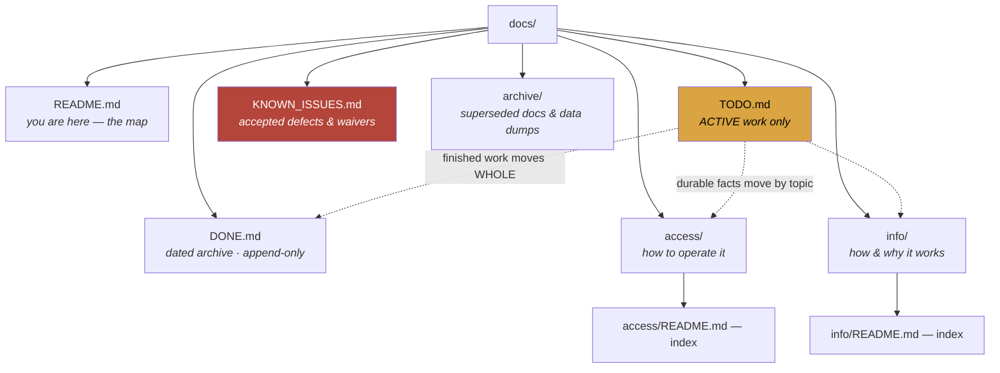

# Board_Game_Catalog — docs map

> **Audience:** Claude/Kiro sessions first, the owner second.
> **Status:** ⚠️ **MIXED** — check `git check-ignore` before assuming a file is tracked.
> Last verified: **2026-08-23** — the HANDOFF rows were re-checked that day; the rest of the tree was not (the tree below was measured that day).
>
> 📐 **The rules for this tree — filing, formatting, when to move things — live
> in `catalog-platform/docs/DOCS_STANDARD.md`, and ONLY there.** All four repos
> follow the same shape. Read it once; it is not restated here.
> ⚠️ It lives in that repo because `catalog-platform/docs/` is the only one of
> the four trees kept in git, so it survives a clone when this one does not.

**What this project is:** the board-game catalogue at `boardgames.heygabi.ai` — the scan queue and barcode ladder, cover art in R2, copy-status history, and the matcher thresholds.

---

## The tree

---

## Start here

| If you want to know… | Read |
|---|---|
| **What is active right now** | [`TODO.md`](TODO.md) |
| **Is this a bug or deliberate?** | [`KNOWN_ISSUES.md`](KNOWN_ISSUES.md) |
| **Current state, what is active** | [`TODO.md`](TODO.md) — the split landed 2026-08-21 |
| **How do I set it up / sign in / reach the APIs** | [`access/SETUP.md`](access/SETUP.md) · [`access/login.md`](access/login.md) · [`access/external-apis.md`](access/external-apis.md) |
| **🔴 Rebuild from nothing** | [`access/RECOVERY.md`](access/RECOVERY.md) |
| **The design, scan queue, thresholds** | [`info/README.md`](info/README.md) · [`info/DESIGN.md`](info/DESIGN.md) |
| **Was this already solved** | [`DONE.md`](DONE.md) |

✅ **That sweep ran on 2026-08-21 and this warning is retired.** It used to say
`HANDOFF.md` was a 223 KB competing living doc where the real state lived.
It is now a **15-line signpost**: finished sections went to `DONE.md`, live
ones to `TODO.md`, traps to `info/gotchas.md`, and the original is kept whole
at [`archive/HANDOFF.superseded-2026-08-21.md`](archive/HANDOFF.superseded-2026-08-21.md).

⚠️ **Verified 2026-08-23.** This repo is the estate’s worked example of the
retirement done properly — `library_catalog` still has the un-retired version
of the same problem, and its TODO carries the task. Copy this shape, not that one.

## Where the rest of the estate is

| Repo | Covers |
|---|---|
| `catalog-platform/docs/` | 📐 **The docs standard**, estate SSO, GABI, `/status`, backups — and the only tree in git |
| `bookbuddy/audiobook_catalog/docs/` | The audiobook pipeline, the shelf server, ebooks |
| `bookbuddy/library_catalog/docs/` | The physical/print catalogue |

⚠️ **This tree is not in git** (wholly or partly), so it exists on the owner's
machine and nowhere else. All four are backed up to R2 by
`catalog-platform/scripts/backup-docs.mjs`; the restore was drilled 2026-08-21.
Runbook: `catalog-platform/docs/access/backup-restore.md` §6b.
