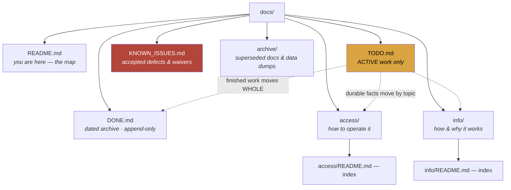

# Board_Game_Catalog — docs map

> **Audience:** Claude/Kiro sessions first, the owner second.
> **Status:** 🔴 **TRACKED, AND THE REPO IS PUBLIC** — every file under `docs/`
> is committed to <https://github.com/skymitch9/Board_Game_Catalog> and readable
> by anyone. Names of secrets only, never values.
> Last verified: **2026-09-05** — the tracking status, the file list and every
> link on this page were re-measured that day (docs audit). ⚠️ The *contents* of
> the files linked below were NOT re-read except `TODO.md`, `access/README.md`
> and `info/README.md`.
>
> 📐 **The rules for this tree — filing, formatting, when to move things — live
> in `catalog-platform/docs/DOCS_STANDARD.md`, and ONLY there.** All four repos
> follow the same shape. Read it once; it is not restated here.
>
> ⚠️ **Corrected 2026-09-05.** The two lines above used to say the status was
> `MIXED — check git check-ignore before assuming a file is tracked`, and that
> `catalog-platform/docs/` was *"the only one of the four trees kept in git"*.
> **Both are false, and the second is why the first was believed.** Measured:
> `git ls-files docs/` returns **55** files here and `git check-ignore` matches
> **none** of them — nothing in this tree is ignored. Across the estate:
> `catalog-platform` **78**, `library_catalog` **56**, this repo **55**,
> `audiobook_catalog` **0** — so three of four trees are in git, and the one
> that is not is the audiobook one. The practical consequence is the opposite
> of what was written: this tree is not a private local file, it is published.

**What this project is:** the board-game catalogue at `boardgames.heygabi.ai` — the scan queue and barcode ladder, cover art in R2, copy-status history, and the matcher thresholds.

---

## The tree

---

## Start here

| If you want to know… | Read |
|---|---|
| **What is active right now — start here** | [`TODO.md`](TODO.md) |
| **Is this a bug or deliberate?** | [`KNOWN_ISSUES.md`](KNOWN_ISSUES.md) |
| **Was this already solved, and why that way?** | [`DONE.md`](DONE.md) |
| **How do I operate / deploy / reach it** | [`access/README.md`](access/README.md) — the index |
| **How do I set it up / sign in / reach the APIs** | [`access/SETUP.md`](access/SETUP.md) · [`access/login.md`](access/login.md) · [`access/external-apis.md`](access/external-apis.md) |
| **How do I ship, and what shipped last?** | [`access/deploys.md`](access/deploys.md) · [`deploys.log`](deploys.log) — the 3am rollback source of truth (tooling writes it) |
| **🔴 Rebuild from nothing** | [`access/RECOVERY.md`](access/RECOVERY.md) |
| **How and why it works** | [`info/README.md`](info/README.md) — the index |
| **The design, scan queue, thresholds** | [`info/DESIGN.md`](info/DESIGN.md) · [`info/scan-queue.md`](info/scan-queue.md) · [`info/matcher-thresholds.md`](info/matcher-thresholds.md) |
| **What did this look like before?** | [`archive/`](archive/) — every `.md` in it opens with a dated retirement banner |
| **Why does `HANDOFF.md` still exist?** | [`HANDOFF.md`](HANDOFF.md) is a **15-line signpost, not state** — kept because ~20 docs still link to it. Follow it once and it sends you here |

⚠️ **Corrected 2026-09-05 (docs audit).** This table had two rows both pointing
at `TODO.md` (*"What is active right now"* and *"Current state, what is
active"*) — one fact, two homes, and the second carried a 2026-08-21 aside that
had nothing to do with the question it answered. It also had no row for
`HANDOFF.md`, `deploys.log`, `archive/` or the `access/` index, so the map did
not name four of the things in the tree it maps. Every link in the table above
was resolved against the filesystem on 2026-09-05.

✅ **That sweep ran on 2026-08-21 and this warning is retired.** It used to say
`HANDOFF.md` was a 223 KB competing living doc where the real state lived.
It is now a **15-line signpost**: finished sections went to `DONE.md`, live
ones to `TODO.md`, traps to `info/gotchas.md`, and the original is kept whole
at [`archive/HANDOFF.superseded-2026-08-21.md`](archive/HANDOFF.superseded-2026-08-21.md).

⚠️ **Verified 2026-08-23.** This repo is the estate’s worked example of the
retirement done properly — `library_catalog` still has the un-retired version
of the same problem, and its TODO carries the task. Copy this shape, not that one.

## Where the rest of the estate is

| Repo | Covers | `docs/` in git? |
|---|---|---|
| `catalog-platform/docs/` | 📐 **The docs standard**, estate SSO, GABI, `/status`, backups | ✅ 78 files |
| `bookbuddy/library_catalog/docs/` | The physical/print catalogue | ✅ 56 files |
| `bookbuddy/audiobook_catalog/docs/` | The audiobook pipeline, the shelf server, ebooks | 🔴 **0 — local only** |

⚠️ **Corrected 2026-09-05 (docs audit).** This block used to read *"This tree is
not in git (wholly or partly), so it exists on the owner's machine and nowhere
else"*, and the table called `catalog-platform` the only tree in git. Measured
with `git ls-files docs/ | wc -l` in each repo on 2026-09-05: the counts in the
new column above. **This tree IS in git and IS public.** The one tree that
really is machine-only is `audiobook_catalog`, and that is the row the backup
argument below actually protects.

All four trees are backed up to R2 by `catalog-platform/scripts/backup-docs.mjs`;
the restore was drilled 2026-08-21 (**not** re-drilled on 2026-09-05 — that
claim still carries its original date). Runbook:
`catalog-platform/docs/access/backup-restore.md` §6b.
